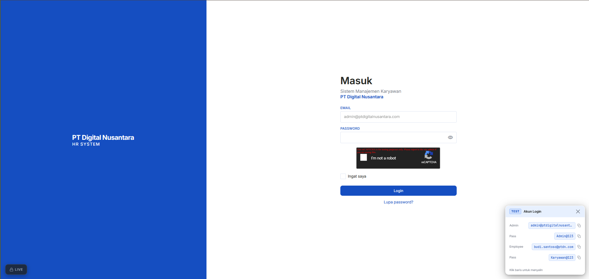
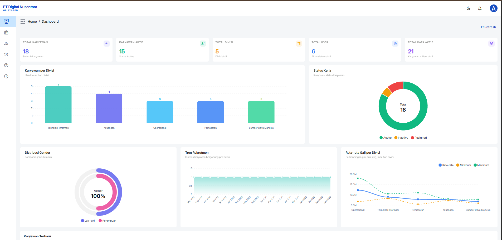
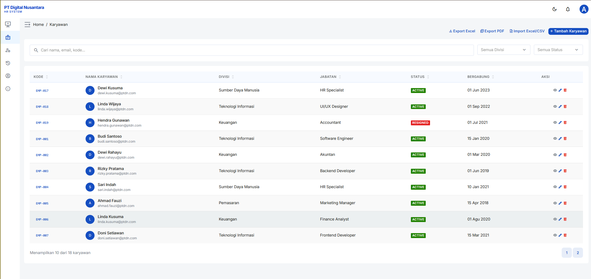

# Sistem Manajemen Karyawan — PT Digital Nusantara

> **Ujian Tengah Semester Genap Tahun Akademik 2025/2026**
> Mata Kuliah: 412563401 Pemrograman Fullstack (3 SKS)
> Dosen: Irfan Nurdiansyah, S.Kom., M.Kom.
> Sifat Ujian: Take Home
>
> **Mahasiswa:** Wisnu Widya Pradana
> **NIM:** 411231088

---

## Daftar Isi

- [Deskripsi Proyek](#deskripsi-proyek)
- [Teknologi yang Digunakan](#teknologi-yang-digunakan)
- [Arsitektur Sistem](#arsitektur-sistem)
- [Fitur Utama](#fitur-utama)
- [Struktur Direktori](#struktur-direktori)
- [Prasyarat](#prasyarat)
- [Panduan Instalasi](#panduan-instalasi)
- [Konfigurasi Environment](#konfigurasi-environment)
- [Menjalankan Aplikasi](#menjalankan-aplikasi)
- [Akun Default](#akun-default)
- [Skema Database](#skema-database)
- [Dokumentasi API](#dokumentasi-api)
- [Keamanan](#keamanan)

---

## Preview

<p align="center">
  
  <br><em>Halaman Login dengan Google reCAPTCHA v2</em>
</p>

<p align="center">
  
  <br><em>Dashboard — Statistik & Visualisasi Data Karyawan</em>
</p>

<p align="center">
  
  <br><em>Manajemen Karyawan — CRUD, Filter, Export</em>
</p>

---

## Deskripsi Proyek

Aplikasi web fullstack untuk mengelola data karyawan PT Digital Nusantara. Sistem ini memungkinkan administrator untuk melakukan pengelolaan data karyawan secara terpusat, termasuk pencarian data, monitoring user, serta pengamanan akses menggunakan JWT dan Session.

Dibangun sebagai pemenuhan tugas UTS mata kuliah Pemrograman Fullstack dengan mengimplementasikan seluruh ketentuan yang ditetapkan: autentikasi hybrid (JWT + Session), CRUD lengkap, search & pagination, dashboard statistik, dan keamanan berlapis.

---

## Teknologi yang Digunakan

### Backend
| Teknologi | Versi | Keterangan |
|---|---|---|
| Node.js | ≥ 18.x | Runtime JavaScript |
| Express.js | 4.x | Web framework |
| MySQL | 8.x | Database relasional |
| mysql2 | 3.x | Driver MySQL (raw SQL, no ORM) |
| bcrypt | 5.x | Hashing password (rounds=12) |
| jsonwebtoken | 9.x | JWT Authentication |
| express-session | 1.x | Session management |
| multer | 1.x | File upload (foto profil) |
| dotenv | 16.x | Environment variables |

### Frontend
| Teknologi | Versi | Keterangan |
|---|---|---|
| Vue 3 | 3.x | Framework UI (Composition API) |
| Vuestic UI | 1.x | Component library admin |
| Pinia | 2.x | State management |
| Axios | 1.x | HTTP client dengan interceptors |
| ApexCharts | 3.x | Visualisasi data dashboard |
| Vue Router | 4.x | Client-side routing |
| Vite | 5.x | Build tool & dev server |

---

## Arsitektur Sistem

```
┌─────────────────────────────────────────────────────────┐
│                    CLIENT (Browser)                      │
│              Vue 3 + Vuestic Admin + Pinia               │
│                   localhost:5173                         │
└─────────────────────┬───────────────────────────────────┘
                      │ HTTP/REST API (via Vite Proxy)
                      │ /api → localhost:5000
┌─────────────────────▼───────────────────────────────────┐
│                  BACKEND (Express.js)                    │
│                   localhost:5000                         │
│                                                         │
│  ┌──────────┐  ┌──────────┐  ┌──────────┐  ┌────────┐  │
│  │  Routes  │→ │Middleware│→ │Controller│→ │  SQL   │  │
│  │          │  │JWT/Session│  │  (MVC)   │  │ Query  │  │
│  └──────────┘  └──────────┘  └──────────┘  └───┬────┘  │
└──────────────────────────────────────────────────┼──────┘
                                                   │
┌──────────────────────────────────────────────────▼──────┐
│                    MySQL Database                        │
│              pt_digital_nusantara                        │
│         employees | users | activity_logs               │
└─────────────────────────────────────────────────────────┘
```

**Auth Flow:**
1. Login → Backend validasi kredensial → Issue JWT + set Session
2. Frontend simpan JWT di `localStorage`
3. Setiap request API sertakan `Authorization: Bearer <token>`
4. Backend verifikasi JWT (API) atau Session (browser) — hybrid auth

---

## Fitur Utama

### ✅ Authentication
- Login dengan email & password
- Google reCAPTCHA v2 verification (dengan toggle Dev/Live mode)
- Logout dengan invalidasi session & token
- JWT Authentication (access token 1 jam + refresh token 7 hari)
- Session Login (express-session)
- Forgot Password dengan token reset (dev mode: token ditampilkan langsung)
- Route protection via Navigation Guard (Vue Router)
- Role-Based Access Control (Admin / Employee)
- Force logout saat password diubah

### ✅ CRUD Data Karyawan
- Tambah karyawan baru dengan 23 kolom data
- Edit data karyawan
- Hapus karyawan (dengan konfirmasi)
- Detail karyawan (modal lengkap)
- Upload foto profil (JPEG/PNG, maks 2MB)
- Export data ke Excel & PDF

### ✅ Search & Pagination
- Search berdasarkan nama, email, kode karyawan
- Filter berdasarkan divisi dan status kerja
- Pagination server-side (10 data per halaman)
- Filler rows untuk konsistensi tinggi tabel antar halaman

### ✅ Dashboard
- Total karyawan, karyawan aktif, total divisi, total user
- Grafik distribusi karyawan per divisi (Bar Chart)
- Grafik status kerja (Donut Chart)
- Grafik distribusi gender (Pie Chart)
- Tabel 5 karyawan terbaru
- Dark mode support

### ✅ Manajemen User
- CRUD akun user sistem
- Role management (Admin / Employee)
- Status management (Active / Inactive)
- Relasi user ke data karyawan

### ✅ Activity Log
- Pencatatan otomatis setiap aksi: login, logout, CRUD karyawan, CRUD user
- Filter log berdasarkan jenis aksi
- Search log berdasarkan username/target
- Pagination log
- Notifikasi bell di navbar dengan pesan natural language

### ✅ Security
- Password hashing bcrypt (rounds=12)
- JWT + Session hybrid authentication
- XSS protection (strip HTML dari semua input)
- SQL Injection prevention (100% parameterized query)
- Enum validation di backend
- Non-negative salary guard
- String length validation
- Strict file upload filter (MIME type + ekstensi)
- Input validation di frontend (regex phone, postal code, email)

---

## Struktur Direktori

```
uts-pemrograman-fullstack/
├── backend/                          # Express.js API Server
│   ├── config/
│   │   ├── db.js                     # MySQL connection pool
│   │   └── multer.js                 # File upload configuration
│   ├── controllers/
│   │   ├── authController.js         # Login, logout, refresh token
│   │   ├── employeeController.js     # CRUD karyawan
│   │   ├── userController.js         # CRUD user & profil
│   │   ├── dashboardController.js    # Statistik dashboard
│   │   └── logController.js          # Activity log
│   ├── database/
│   │   ├── schema.sql                # DDL tabel + seed data
│   │   ├── seeder.sql                # Data sample karyawan & user
│   │   └── activity_logs.sql         # DDL tabel activity_logs
│   ├── middlewares/
│   │   └── authMiddleware.js         # JWT, Session, adminOnly, errorHandler
│   ├── routes/
│   │   ├── authRoutes.js
│   │   ├── employeeRoutes.js
│   │   ├── userRoutes.js
│   │   ├── dashboardRoutes.js
│   │   └── logRoutes.js
│   ├── utils/
│   │   ├── logger.js                 # Activity log helper
│   │   ├── sanitize.js               # XSS & input validation utils
│   │   ├── pagination.js             # Pagination helper
│   │   ├── fileHelper.js             # File management
│   │   └── exportHelper.js           # Excel & PDF export
│   ├── uploads/                      # File upload storage (gitignored)
│   ├── .env                          # Environment variables (lihat contoh)
│   ├── .env.example                  # Template environment variables
│   ├── package.json
│   └── server.js                     # Entry point Express
│
└── vuestic-admin/                    # Vue 3 Frontend
    ├── src/
    │   ├── components/
    │   │   ├── navbar/               # Navbar + notification bell
    │   │   └── sidebar/              # Navigation routes
    │   ├── pages/
    │   │   ├── admin/dashboard/      # Dashboard dengan ApexCharts
    │   │   ├── auth/                 # Login page
    │   │   ├── employees/            # CRUD karyawan
    │   │   ├── users/                # Manajemen user
    │   │   ├── logs/                 # Activity log
    │   │   └── profile/              # Profil pengguna
    │   ├── stores/
    │   │   ├── auth.ts               # Auth state (Pinia)
    │   │   ├── employee.ts           # Employee state
    │   │   ├── userManagement.ts     # User management state
    │   │   └── notificationStore.ts  # Notification bell state
    │   ├── services/
    │   │   └── apiClient.ts          # Axios instance + interceptors
    │   ├── router/
    │   │   └── index.ts              # Vue Router + navigation guard
    │   └── scss/
    │       ├── main.scss             # Global typography & button styles
    │       └── vuestic.scss          # Vuestic component overrides
    ├── .env                          # Frontend environment variables
    ├── vite.config.ts                # Vite config + API proxy
    └── package.json
```

---

## Prasyarat

Pastikan perangkat lunak berikut sudah terinstal:

| Software | Versi Minimum |
|---|---|
| Node.js | 18.x LTS |
| npm | 9.x |
| MySQL | 8.x |
| Git | 2.x |

---

## Panduan Instalasi

### 1. Clone Repository

```bash
git clone <repository-url>
cd uts-pemrograman-fullstack
```

### 2. Setup Database

Pastikan MySQL Anda sudah menyala (XAMPP/Laragon/Native). Ikuti urutan import berikut agar tidak terjadi error relasi:

```bash
# 1. Masuk ke MySQL dan buat database
mysql -u root -p -e "CREATE DATABASE pt_digital_nusantara CHARACTER SET utf8mb4 COLLATE utf8mb4_unicode_ci;"

# 2. Import Schema Utama
mysql -u root -p pt_digital_nusantara < backend/database/schema.sql

# 3. Import Tabel Activity Logs
mysql -u root -p pt_digital_nusantara < backend/database/activity_logs.sql

# 4. Import Seed Data (Akun Admin & Contoh Karyawan)
mysql -u root -p pt_digital_nusantara < backend/database/seeder.sql
```

> **Tips Windows:** Jika perintah `mysql` tidak ditemukan, gunakan **XAMPP Shell** atau **Laragon Terminal**. Jika Anda menggunakan port custom (misal XAMPP di `3307`), tambahkan flag `-P 3307` di setiap perintah di atas.

### 3. Setup Backend

```bash
cd backend

# Install dependencies
npm install

# Salin dan konfigurasi environment
cp .env.example .env
# Edit .env sesuai konfigurasi lokal (lihat bagian Konfigurasi Environment)
```

### 4. Setup Frontend

```bash
cd ../vuestic-admin

# Install dependencies (Gunakan flag ini jika di Windows/Husky error)
npm install --legacy-peer-deps --ignore-scripts
```

---

## Troubleshooting (Solusi Masalah Umum)

Jika Anda menemui error saat setup, berikut adalah solusinya:

### ❌ `'vite' is not recognized as an internal or external command`
**Penyebab:** Instalasi `node_modules` gagal atau terhenti di tengah jalan (biasanya karena Husky).
**Solusi:**
1. Hapus folder `node_modules` jika ada.
2. Jalankan perintah instalasi dengan mengabaikan script:
   ```bash
   npm install --legacy-peer-deps --ignore-scripts
   ```

### ❌ `husky - .git can't be found`
**Penyebab:** Husky mencoba mencari folder `.git` tapi gagal karena struktur folder project.
**Solusi:** Gunakan flag `--ignore-scripts` saat `npm install` seperti poin di atas. Anda tidak membutuhkan Husky hanya untuk menjalankan aplikasi secara lokal.

### ❌ `Database connection failed: Access denied for user 'root'@'localhost'`
**Penyebab:** Password MySQL di `.env` salah atau MySQL belum dijalankan.
**Solusi:**
1. Pastikan MySQL (XAMPP/Laragon) sudah **Running**.
2. Cek file `backend/.env`, pastikan `DB_PASSWORD` sesuai dengan password MySQL Anda. Jika pakai XAMPP, biasanya dikosongkan (`DB_PASSWORD=`).
3. Pastikan database `pt_digital_nusantara` sudah dibuat.

### ❌ `ERESOLVE could not resolve dependency (pinia/vue mismatch)`
**Penyebab:** Konflik versi antara Vue dan Pinia.
**Solusi:** Tambahkan flag `--legacy-peer-deps` saat melakukan `npm install`.

---

## Konfigurasi Environment

### Backend (`backend/.env`)

```env
# Server
PORT=5000
NODE_ENV=development
APP_URL=http://localhost:5000
FRONTEND_URL=http://localhost:5173

# Database MySQL
DB_HOST=localhost
DB_PORT=3306
DB_USER=root
DB_PASSWORD=           # isi password MySQL Anda
DB_NAME=pt_digital_nusantara

# JWT
JWT_SECRET=ganti_dengan_secret_yang_kuat
JWT_EXPIRES_IN=1h
JWT_REFRESH_SECRET=ganti_dengan_refresh_secret_yang_kuat
JWT_REFRESH_EXPIRES_IN=7d

# Session
SESSION_SECRET=ganti_dengan_session_secret_yang_kuat

# Google reCAPTCHA v2 (opsional untuk development)
RECAPTCHA_SECRET_KEY=your_recaptcha_secret_key
RECAPTCHA_SITE_KEY=your_recaptcha_site_key
```

> **Catatan Development:** Gunakan `captchaToken: "dev"` untuk bypass CAPTCHA di environment development.

### Frontend (`vuestic-admin/.env`)

```env
VITE_API_BASE_URL=/api
VITE_RECAPTCHA_SITE_KEY=6LeIxAcTAAAAAJcZVRqyHh71UMIEGNQ_MXjiZKhI
```

> Frontend menggunakan Vite proxy — semua request ke `/api` akan diteruskan ke `http://localhost:5000/api` secara otomatis. Tidak perlu konfigurasi CORS tambahan di development.
>
> **reCAPTCHA:** Site key di atas adalah [Google Test Key](https://developers.google.com/recaptcha/docs/faq#id-like-to-run-automated-tests-with-recaptcha.-what-should-i-do) yang selalu lolos verifikasi — cocok untuk development & demo.

---

## Menjalankan Aplikasi

### Development Mode

Jalankan backend dan frontend di dua terminal terpisah:

**Terminal 1 — Backend:**
```bash
cd backend
npm run dev
# Server berjalan di http://localhost:5000
```

**Terminal 2 — Frontend:**
```bash
cd vuestic-admin
npm run dev
# Aplikasi berjalan di http://localhost:5173
```

### Production Build

```bash
cd vuestic-admin
npm run build
# Output di dist/
```

---

## Akun Default

Setelah menjalankan `seeder.sql`, akun berikut tersedia:

| Role | Email | Password |
|---|---|---|
| Admin | `admin@ptdigitalnusantara.com` | `Admin@123` |
| Employee | `budi.santoso@ptdn.com` | `Karyawan@123` |
| Employee | `dewi.rahayu@ptdn.com` | `Karyawan@123` |
| Employee | `rizky.pratama@ptdn.com` | `Karyawan@123` |
| Employee | `sari.indah@ptdn.com` | `Karyawan@123` |
| Employee | `ahmad.fauzi@ptdn.com` | `Karyawan@123` |

**Role-Based Access:**
- **Admin** — Full access: Dashboard, CRUD Karyawan, Manajemen User, Activity Log, Export data
- **Employee** — Read-only: Dashboard, lihat daftar karyawan (tanpa aksi edit/hapus), Profile

> **Penting:** Ganti semua password default sebelum deployment ke production.

---

## Skema Database

### Tabel `employees`

| Kolom | Tipe Data | Keterangan |
|---|---|---|
| id | INT (PK, AI) | ID unik karyawan |
| employee_code | VARCHAR(20) | Kode unik karyawan (EMP-001) |
| full_name | VARCHAR(100) | Nama lengkap karyawan |
| gender | ENUM('Male','Female') | Jenis kelamin |
| birth_date | DATE | Tanggal lahir |
| email | VARCHAR(100) | Email karyawan |
| phone_number | VARCHAR(20) | Nomor telepon |
| address | TEXT | Alamat lengkap |
| city | VARCHAR(100) | Kota |
| province | VARCHAR(100) | Provinsi |
| postal_code | VARCHAR(10) | Kode pos |
| division | VARCHAR(100) | Divisi |
| position | VARCHAR(100) | Jabatan |
| salary | DECIMAL(12,2) | Gaji |
| join_date | DATE | Tanggal bergabung |
| employment_status | ENUM('Active','Inactive','Resigned') | Status kerja |
| profile_photo | VARCHAR(255) | Nama file foto profil |
| emergency_contact | VARCHAR(100) | Nama kontak darurat |
| emergency_phone | VARCHAR(20) | Nomor kontak darurat |
| education | VARCHAR(100) | Pendidikan terakhir |
| marital_status | ENUM('Single','Married') | Status pernikahan |
| created_at | TIMESTAMP | Waktu dibuat |
| updated_at | TIMESTAMP | Waktu diperbarui |

### Tabel `users`

| Kolom | Tipe Data | Keterangan |
|---|---|---|
| id | INT (PK, AI) | ID unik user |
| employee_id | INT (FK) | Relasi ke tabel employees |
| username | VARCHAR(100) | Username login |
| email | VARCHAR(100) | Email login |
| password | VARCHAR(255) | Password (bcrypt hash) |
| role | ENUM('Admin','Employee') | Hak akses |
| status | ENUM('Active','Inactive') | Status akun |
| remember_token | VARCHAR(255) | Refresh token |
| last_login | DATETIME | Waktu login terakhir |
| created_at | TIMESTAMP | Waktu dibuat |
| updated_at | TIMESTAMP | Waktu diperbarui |

### Tabel `activity_logs`

| Kolom | Tipe Data | Keterangan |
|---|---|---|
| id | INT (PK, AI) | ID log |
| user_id | INT (FK, nullable) | User yang melakukan aksi |
| action | VARCHAR(50) | Jenis aksi |
| target | VARCHAR(100) | Target aksi |
| details | TEXT | Detail dalam format JSON |
| ip_address | VARCHAR(45) | IP address client |
| created_at | TIMESTAMP | Waktu aksi |

---

## Dokumentasi API

Base URL: `http://localhost:5000/api`

### Authentication

| Method | Endpoint | Deskripsi | Auth |
|---|---|---|---|
| POST | `/auth/login` | Login user | — |
| POST | `/auth/logout` | Logout user | ✓ |
| POST | `/auth/refresh` | Refresh access token | — |
| GET | `/auth/me` | Data user yang login | ✓ |

### Karyawan

| Method | Endpoint | Deskripsi | Auth |
|---|---|---|---|
| GET | `/employees` | Daftar karyawan (search, filter, pagination) | ✓ |
| GET | `/employees/:id` | Detail karyawan | ✓ |
| POST | `/employees` | Tambah karyawan | Admin |
| PUT | `/employees/:id` | Update karyawan | Admin |
| DELETE | `/employees/:id` | Hapus karyawan | Admin |
| GET | `/employees/divisions` | Daftar divisi | ✓ |
| GET | `/employees/export` | Export Excel/PDF | Admin |

### User

| Method | Endpoint | Deskripsi | Auth |
|---|---|---|---|
| GET | `/users` | Daftar user | Admin |
| GET | `/users/:id` | Detail user | Admin |
| POST | `/users` | Tambah user | Admin |
| PUT | `/users/:id` | Update user | Admin |
| DELETE | `/users/:id` | Hapus user | Admin |
| PUT | `/users/profile` | Update profil sendiri | ✓ |

### Dashboard

| Method | Endpoint | Deskripsi | Auth |
|---|---|---|---|
| GET | `/dashboard/stats` | Statistik dashboard | ✓ |

### Activity Log

| Method | Endpoint | Deskripsi | Auth |
|---|---|---|---|
| GET | `/logs` | Daftar activity log | Admin |
| GET | `/logs/actions` | Daftar jenis aksi | Admin |

---

## Keamanan

### Implementasi

| Aspek | Implementasi |
|---|---|
| Password Hashing | bcrypt dengan cost factor 12 |
| Authentication | Hybrid JWT + Session |
| Authorization | Role-based (Admin / Employee) |
| XSS Protection | Strip HTML/script dari semua string input |
| SQL Injection | 100% parameterized query (`?` placeholder) |
| CSRF | Session-based dengan SameSite cookie |
| File Upload | Validasi MIME type + ekstensi (JPEG/PNG only, maks 2MB) |
| Input Validation | Enum check, length guard, email regex, non-negative salary |
| Route Protection | Navigation Guard di Vue Router |

### Catatan Penting untuk Production

1. Ganti semua nilai secret di `.env` dengan nilai yang kuat dan acak
2. Set `NODE_ENV=production`
3. Aktifkan `secure: true` pada cookie session
4. Daftarkan domain di Google reCAPTCHA dan isi `RECAPTCHA_SECRET_KEY`
5. Hapus atau nonaktifkan CAPTCHA bypass (`"dev"` token)
6. Hapus komponen `DevCredentials.vue`
7. Konfigurasi HTTPS

---

## Lisensi

Proyek ini dibuat untuk keperluan akademik — UTS Mata Kuliah Pemrograman Fullstack, Program Studi Teknik Informatika.

---

*Dibuat dengan Node.js, Express.js, Vue 3, dan MySQL.*
